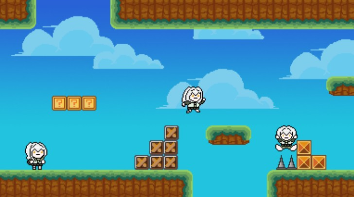
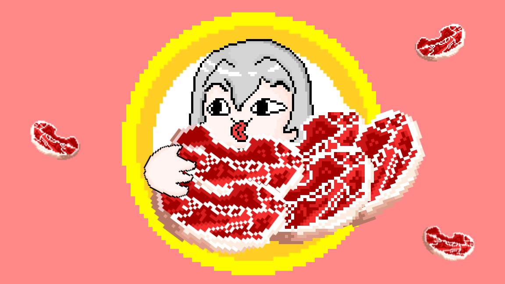

# 훈프리 기록저장소

## Next Plan

* `프리런` - 다음 프로젝트: 런게임 개발기

### 📸 개발 스크린샷 갤러리

  

    
    
1. 메인 타이틀 화면

  

  

    
    
2. 캐릭터 설정 및 맵 구성

  

  

    
    
3. 인게임 사망 판정 테스트

  

  

    
    
4. 실제 게임 플레이 화면

  

  

    
    
5. 데드 씬 연출

  

  

    
    
6. 게임 종료 및 결과 창

  

---

### 📝 개발 노트

위 이미지는 AI 생성물이 아닌 '훈프리'의 개인 도트 작업물입니다.